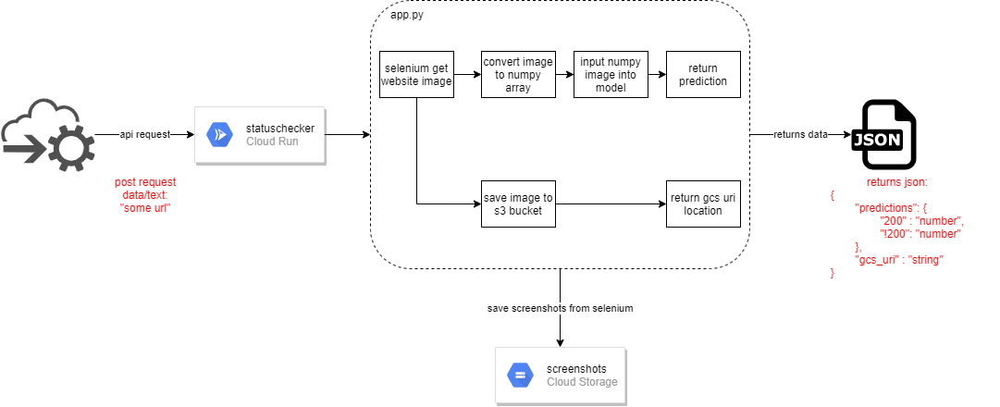

# website_screenshot_model
construct model from data generated by `simple_spider`


## instructions:

make requests to `https://statuschecker-5t577kjzuq-nw.a.run.app`.

This accepts `data/text` formats of a url.

It will return a json object of:

```json
{
    "predictions": {
        "200": "number",
        "!200": "number"
    },
    "gcs_uri" : "string"
} 
```

**note**: the `gcs_uri` is not implemented.

### example

```bash
curl -d 'http://www.example.com' 'https://statuschecker-5t577kjzuq-nw.a.run.app'
```

## UML function 

Simple implementation of how the cloud run works


## Model params
```python
__________________________________________________________________________________________________
Layer (type)                    Output Shape         Param #     Connected to
==================================================================================================
image (InputLayer)              [(None, 640, 360, 3) 0
__________________________________________________________________________________________________
conv2d (Conv2D)                 (None, 640, 360, 16) 448         image[0][0]
__________________________________________________________________________________________________
conv2d_1 (Conv2D)               (None, 640, 360, 16) 2320        conv2d[0][0]
__________________________________________________________________________________________________
conv2d_2 (Conv2D)               (None, 640, 360, 16) 64          image[0][0]
__________________________________________________________________________________________________
add (Add)                       (None, 640, 360, 16) 0           conv2d_1[0][0]
                                                                 conv2d_2[0][0]
__________________________________________________________________________________________________
max_pooling2d (MaxPooling2D)    (None, 320, 180, 16) 0           add[0][0]
__________________________________________________________________________________________________
batch_normalization (BatchNorma (None, 320, 180, 16) 64          max_pooling2d[0][0]
__________________________________________________________________________________________________
dropout (Dropout)               (None, 320, 180, 16) 0           batch_normalization[0][0]
__________________________________________________________________________________________________
conv2d_3 (Conv2D)               (None, 320, 180, 32) 4640        dropout[0][0]
__________________________________________________________________________________________________
conv2d_4 (Conv2D)               (None, 320, 180, 32) 9248        conv2d_3[0][0]
__________________________________________________________________________________________________
conv2d_5 (Conv2D)               (None, 320, 180, 32) 544         dropout[0][0]
__________________________________________________________________________________________________
add_1 (Add)                     (None, 320, 180, 32) 0           conv2d_4[0][0]
                                                                 conv2d_5[0][0]
__________________________________________________________________________________________________
max_pooling2d_1 (MaxPooling2D)  (None, 160, 90, 32)  0           add_1[0][0]
__________________________________________________________________________________________________
batch_normalization_1 (BatchNor (None, 160, 90, 32)  128         max_pooling2d_1[0][0]
__________________________________________________________________________________________________
dropout_1 (Dropout)             (None, 160, 90, 32)  0           batch_normalization_1[0][0]
__________________________________________________________________________________________________
conv2d_6 (Conv2D)               (None, 160, 90, 64)  18496       dropout_1[0][0]
__________________________________________________________________________________________________
conv2d_7 (Conv2D)               (None, 160, 90, 64)  36928       conv2d_6[0][0]
__________________________________________________________________________________________________
conv2d_8 (Conv2D)               (None, 160, 90, 64)  2112        dropout_1[0][0]
__________________________________________________________________________________________________
add_2 (Add)                     (None, 160, 90, 64)  0           conv2d_7[0][0]
                                                                 conv2d_8[0][0]
__________________________________________________________________________________________________
max_pooling2d_2 (MaxPooling2D)  (None, 80, 45, 64)   0           add_2[0][0]
__________________________________________________________________________________________________
batch_normalization_2 (BatchNor (None, 80, 45, 64)   256         max_pooling2d_2[0][0]
__________________________________________________________________________________________________
dropout_2 (Dropout)             (None, 80, 45, 64)   0           batch_normalization_2[0][0]
__________________________________________________________________________________________________
conv2d_9 (Conv2D)               (None, 80, 45, 96)   55392       dropout_2[0][0]
__________________________________________________________________________________________________
conv2d_10 (Conv2D)              (None, 80, 45, 96)   83040       conv2d_9[0][0]
__________________________________________________________________________________________________
conv2d_11 (Conv2D)              (None, 80, 45, 96)   6240        dropout_2[0][0]
__________________________________________________________________________________________________
add_3 (Add)                     (None, 80, 45, 96)   0           conv2d_10[0][0]
                                                                 conv2d_11[0][0]
__________________________________________________________________________________________________
max_pooling2d_3 (MaxPooling2D)  (None, 40, 22, 96)   0           add_3[0][0]
__________________________________________________________________________________________________
batch_normalization_3 (BatchNor (None, 40, 22, 96)   384         max_pooling2d_3[0][0]
__________________________________________________________________________________________________
dropout_3 (Dropout)             (None, 40, 22, 96)   0           batch_normalization_3[0][0]
__________________________________________________________________________________________________
conv2d_12 (Conv2D)              (None, 40, 22, 128)  110720      dropout_3[0][0]
__________________________________________________________________________________________________
conv2d_13 (Conv2D)              (None, 40, 22, 128)  147584      conv2d_12[0][0]
__________________________________________________________________________________________________
conv2d_14 (Conv2D)              (None, 40, 22, 128)  12416       dropout_3[0][0]
__________________________________________________________________________________________________
add_4 (Add)                     (None, 40, 22, 128)  0           conv2d_13[0][0]
                                                                 conv2d_14[0][0]
__________________________________________________________________________________________________
max_pooling2d_4 (MaxPooling2D)  (None, 20, 11, 128)  0           add_4[0][0]
__________________________________________________________________________________________________
batch_normalization_4 (BatchNor (None, 20, 11, 128)  512         max_pooling2d_4[0][0]
__________________________________________________________________________________________________
dropout_4 (Dropout)             (None, 20, 11, 128)  0           batch_normalization_4[0][0]
__________________________________________________________________________________________________
conv2d_15 (Conv2D)              (None, 20, 11, 160)  184480      dropout_4[0][0]
__________________________________________________________________________________________________
conv2d_16 (Conv2D)              (None, 20, 11, 160)  230560      conv2d_15[0][0]
__________________________________________________________________________________________________
conv2d_17 (Conv2D)              (None, 20, 11, 160)  20640       dropout_4[0][0]
__________________________________________________________________________________________________
add_5 (Add)                     (None, 20, 11, 160)  0           conv2d_16[0][0]
                                                                 conv2d_17[0][0]
__________________________________________________________________________________________________
max_pooling2d_5 (MaxPooling2D)  (None, 10, 5, 160)   0           add_5[0][0]
__________________________________________________________________________________________________
batch_normalization_5 (BatchNor (None, 10, 5, 160)   640         max_pooling2d_5[0][0]
__________________________________________________________________________________________________
dropout_5 (Dropout)             (None, 10, 5, 160)   0           batch_normalization_5[0][0]
__________________________________________________________________________________________________
conv2d_18 (Conv2D)              (None, 10, 5, 192)   276672      dropout_5[0][0]
__________________________________________________________________________________________________
conv2d_19 (Conv2D)              (None, 10, 5, 192)   331968      conv2d_18[0][0]
__________________________________________________________________________________________________
conv2d_20 (Conv2D)              (None, 10, 5, 192)   30912       dropout_5[0][0]
__________________________________________________________________________________________________
add_6 (Add)                     (None, 10, 5, 192)   0           conv2d_19[0][0]
                                                                 conv2d_20[0][0]
__________________________________________________________________________________________________
max_pooling2d_6 (MaxPooling2D)  (None, 5, 2, 192)    0           add_6[0][0]
__________________________________________________________________________________________________
batch_normalization_6 (BatchNor (None, 5, 2, 192)    768         max_pooling2d_6[0][0]
__________________________________________________________________________________________________
dropout_6 (Dropout)             (None, 5, 2, 192)    0           batch_normalization_6[0][0]
__________________________________________________________________________________________________
conv2d_21 (Conv2D)              (None, 5, 2, 224)    387296      dropout_6[0][0]
__________________________________________________________________________________________________
conv2d_22 (Conv2D)              (None, 5, 2, 224)    451808      conv2d_21[0][0]
__________________________________________________________________________________________________
conv2d_23 (Conv2D)              (None, 5, 2, 224)    43232       dropout_6[0][0]
__________________________________________________________________________________________________
add_7 (Add)                     (None, 5, 2, 224)    0           conv2d_22[0][0]
                                                                 conv2d_23[0][0]
__________________________________________________________________________________________________
max_pooling2d_7 (MaxPooling2D)  (None, 2, 1, 224)    0           add_7[0][0]
__________________________________________________________________________________________________
batch_normalization_7 (BatchNor (None, 2, 1, 224)    896         max_pooling2d_7[0][0]
__________________________________________________________________________________________________
dropout_7 (Dropout)             (None, 2, 1, 224)    0           batch_normalization_7[0][0]
__________________________________________________________________________________________________
conv2d_24 (Conv2D)              (None, 1, 1, 512)    229888      dropout_7[0][0]
__________________________________________________________________________________________________
flatten (Flatten)               (None, 512)          0           conv2d_24[0][0]
__________________________________________________________________________________________________
dense (Dense)                   (None, 512)          262656      flatten[0][0]
__________________________________________________________________________________________________
dense_1 (Dense)                 (None, 2)            1026        dense[0][0]
==================================================================================================
Total params: 2,944,978
Trainable params: 2,943,154
Non-trainable params: 1,824
__________________________________________________________________________________________________
```